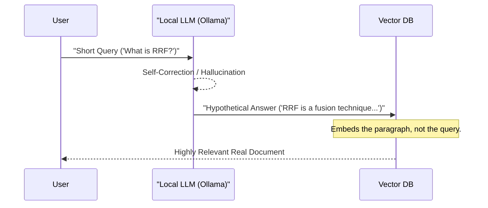

# Stage 3: HyDE (Hypothetical Document Embeddings)

HyDE is a powerful query transformation technique designed to bridge the vocabulary gap between a user's short query and the detailed content of technical documents.

## ✨ Transformation Flow

## ❓ The Problem: Vocabulary Mismatch
Users often ask short questions using imprecise language. Technical documents use precise, dense jargon. 
*   **Query**: "How to fix slow RAG?"
*   **Document**: "Optimizing retrieval latency via quantization and HNSW indexing."
Vector search alone might miss the connection because the word "slow" isn't in the document.

## ✅ The Solution: HyDE
1. **Zero-Shot Generation**: We ask a local LLM to "Generate a technical paragraph that answers: {query}". 
2. **Structural Alignment**: Even if the LLM makes up facts, it will use the correct *vocabulary* and *sentence structure* (e.g., "latency", "optimization", "index").
3. **Paragraph-to-Paragraph Search**: We embed this generated paragraph. Because it looks like a real document, its embedding is much closer to the actual documents in your index than a short query would be.

## 🚀 Implementation
See [core/hyde.py](../../core/hyde.py). This stage uses `ollama` locally to ensure zero data leakage while performing the transformation.
