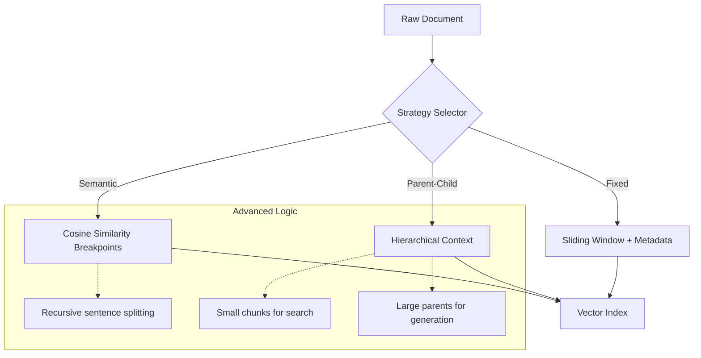

# Stage 1: Ingestion & Advanced Chunking

The ingestion stage is where raw text is transformed into a structured, searchable index. Unlike naive RAG which uses fixed-size overlaps, our system implements three sophisticated strategies to preserve semantic context.

## 📐 Architecture Overview

## 1. Semantic Chunking
Instead of splitting by character count, we analyze the semantic drift between sentences.
- **Process**: We split the text into sentences, embed them, and calculate the cosine similarity between adjacent sentence groups.
- **Breakpoint**: When similarity drops below a percentile threshold (default 95th), we trigger a new chunk.
- **Benefit**: Every chunk is a cohesive "thought," preventing the LLM from receiving half-sentences or fragmented context.

## 2. Parent-Child (Auto-Merging) Retrieval
This strategy solves the "Granularity Paradox": small chunks are better for search (higher precision), but large chunks are better for generation (richer context).
- **Process**:
    1. Split text into large **Parent Chunks** (e.g., 1000 tokens).
    2. Sub-divide each parent into many small **Child Chunks** (e.g., 150 tokens).
- **Retrieval Logic**: During search, we retrieve the small children. If multiple children from the same parent are found, the system automatically swaps them for the single, cohesive parent.

## 3. Metadata Enrichment
Every chunk is tagged with:
- `source`: File name or URL.
- `chunk_type`: Strategy used.
- `ingested_at`: ISO timestamp.
- `token_count`: Accurate sizing for context window management.

## 🚀 Implementation
See [core/chunker.py](../../core/chunker.py) for the implementation of the `AdvancedChunker` class.
