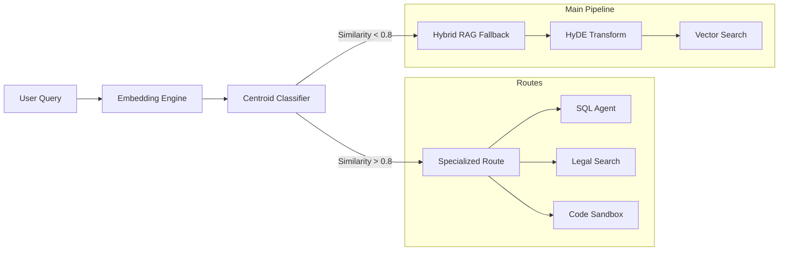

# Stage 2: Semantic Routing

The Semantic Router acts as the "Air Traffic Controller" of the RAG pipeline. It analyzes the user's intent before any retrieval happens, directing the query to the specialized agent or database that is most likely to have the answer.

## 🔀 Decision Logic

## 🧠 Mechanism
1. **Centroid Embedding**: We define semantic "centroids" (clusters of embeddings) for different domains (e.g., mathematical, coding, conversational).
2. **Distance Calculation**: The user's query is embedded and compared against these centroids using cosine similarity.
3. **Threshold Gate**: 
    - If the query is highly similar to a specific route (e.g., "What is the revenue for Q3?" -> `sql_agent`), the router locks onto that target.
    - If the query is ambiguous, it falls back to the standard `hybrid` RAG pipeline.

## 🛠️ Advantages
- **Efficiency**: Bypasses the vector database for queries that can be answered better by specialized tools (like a calculator or SQL DB).
- **Determinism**: Prevents the RAG system from trying to "hallucinate" an answer from text when a structured database is available.
- **Speed**: Routing decisions take <10ms using lightweight embedding comparisons.

## 🚀 Implementation
See [core/router.py](../../core/router.py) for the implementation of the `SemanticRouter` and intent classification logic.
