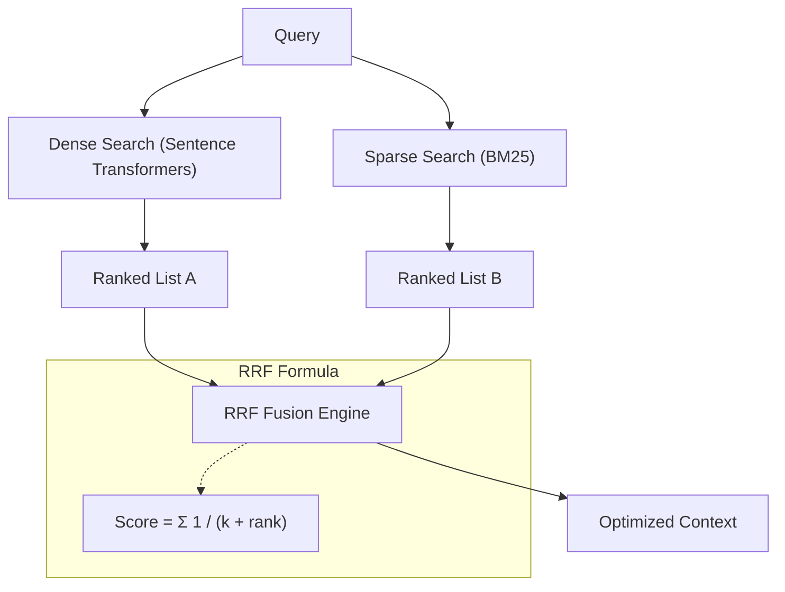

# Stage 4: Hybrid Search & RRF

Hybrid search combines the semantic power of **Dense Vectors** with the keyword precision of **Sparse BM25**, fused together using the **Reciprocal Rank Fusion (RRF)** algorithm.

## 🔗 Fusion Architecture

## 1. Dense Vector Search (Semantic)
- **Strengths**: Understands synonyms, context, and "meaning."
- **Weakness**: Struggles with exact keyword matches, acronyms, and specific product names.

## 2. Sparse Search (BM25)
- **Strengths**: Perfect for exact matches, unique IDs, and rare keywords.
- **Weakness**: Fails if the user uses a synonym (e.g., "automobile" vs "car").

## 3. Reciprocal Rank Fusion (RRF)
RRF is a deterministic algorithm that combines multiple ranked lists into a single one without needing to "normalize" scores (which is historically difficult for hybrid search).

- **The Logic**: A document is rewarded for being at the top of *any* list, and heavily rewarded for being at the top of *multiple* lists.
- **Why RRF?**: It is production-grade and "plug-and-play." Unlike Alpha-tuning ($ \alpha \cdot dense + (1-\alpha) \cdot sparse $), RRF doesn't require constant retraining to maintain balance.

## 🚀 Implementation
See [core/hybrid_search.py](../../core/hybrid_search.py) for the implementation of the fusion engine and rank-merging logic.
